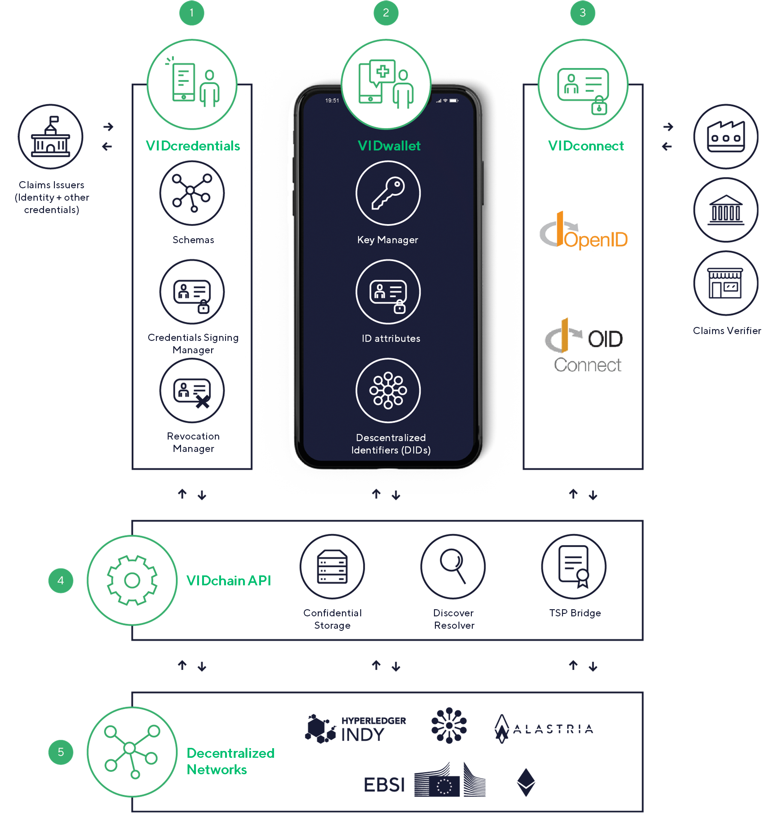

# Introduction

VIDchain is a product of [Validated ID](https://www.validatedid.com/), a Spanish Qualified Trust Service Provider, providing Self-Sovereign Identity (SSI) and related services. SSI is a rather new concept for managing digital identities with the main goal to return the control over identity data back to the users. If you are interested in further explore SSI and its potential please check out our [SSI Whitepaper](https://www.validatedid.com/vidchain).

## Documentation Overview

This documentation presents several layer of information starting with general information for the general public and everybody that is interested in VIDchain up to integration guides together with a detailed API description for architects and developers to be able to integrate VIDchain services into their systems. The documentation is structure in the following four sections:

1. [VIDchain](0-vidchain.md): This page presents an overview of VIDchain including its components.
2. [Components](1-Components/0-vidcredential.md): The important components are detailed in the specific components section.
3. [Integration Guides](2-Integration%20Guides/0-overview.md): The integration guides detail the necessary steps for the integration of our services into target systems.
4. [OpenAPIs Specifications](https://docs.vidchain.net/vidcredentials-openapi): The integration guides are supported by detailed API specification.

## Main Features

To highlight the advantages of using VIDchain as SSI services provider, we list following the main features of our services:

- By using our services including the identity wallet, users are in **full control over their own identity data**.
- Our services are **fully GDPR-compliant**. By utilizing our services, customers will not have to worry about GDPR compliance.
- SSI vendors often depend on a distributed ledger (DL) or blockchain network. VIDchain offers flexibility by **being fully ledger agnostic**. In fact, VIDchain services can operate even without DL or blockchain but nevertheless, VIDchain is integrated with several DLTs such as EBSI, Alastria, Dalion, Ethereum,...
- VIDchain offers a **passwordless authentication flow**, which increases not only the user-experience but also the security since users tend to resuse username-password combinations or use-easy-to-guess passwords.
- VIDchain services can be **integrated and used on different platforms** such as in the web or on a webapp or mobile app.
- VIDchain offers a service to **manage and handle credentials including, creating, signing, issuing, storing, revoking, exchanging and presenting verifiable credentials**.
- VIDchain **binds legal entities to verifiable credentials**. Legal entities such as natural and legal persons are often represented by X509 certificates. This binding is achieved by our so-called [eIDAS bridge](1-Components/2-eidas-bridge.md). By sealing the verifiable credential with a qualified certificate, also **legal value is added to the verifiable credential** and can be verified afterwards.
- Users might own a personal certificate containing the users' attributes. VIDchain offers a service, called [certbridge](https://certbridge.vidchain.net/), to **transform a X509 certificate into a valid verifiable credential**.
- Users can **create credentials based on different sources** such as from:
  - national IDs like passports, national ID cards, or certificates
  - financial institutions using the PSD2 broker
  - social networks
  - email account
  - phone number
- The field of SSI is relatively new and standards for data formats and protocols are emerging. **VIDchain aims to be aligned with the SSI related standards** uch as OpenID Connect, VC W3C, DID W3C, DIF confidential storage, ...
- VIDchain allows users to quickly learn how SSI and VIDchain works by **providing an interactive and guided [Tutorial](https://try.vidchain.net/demo).**

## Components Overview

VIDchain is composed of different building blocks depicted in the architecture figure and listed below:

- [VIDcredentials](1-Components/0-vidcredential.md): this component's main purpose is to handle the credential lifecycle as well as credential related data. Handling credentials includes creating, signing and verifying verifiable credentials, but also managing schemas and the revocation management.
- [VIDconnect](1-Components/1-vidconnect.md): an OpenID Connect provider that is able to perform a DID authentication process. The OpenID Connect SIOP library, a Typescript library, that you can use from your app to exchange credentials with the VIDwallet.
- [eIDAS Bridge](1-Components/2-eidas-bridge.md): the eIDAS Bridge is a project that aims to bridge legal entities based on X509 certificates with W3C based verfiable credentials.
- [VIDwallet](1-Components/3-vidwallet.md): a mobile application used by end-users with the main purpose to manage and store their key matrial and personal information such as identifiers and credentials.

<figcaption align="center">
This figure depicts VIDchain's overall architecture on a very high-level. Also, it illustrates the main components, actors and communication flows. Each component consists of several subcomponents that implements different functionality focusing on different kind of data.
</figcaption>

## Links and References

- [Validated ID Website](https://www.validatedid.com)
- [VIDchain Website](https://www.validatedid.com/vidchain)
- [VIDcredentials OpenAPI Specification](https://docs.vidchain.net/vidcredentials-openapi)
- [VIDconnect OpenAPI Specification](https://docs.vidchain.net/vidconnect-openapi)
- [eIDAS Bridge OpenAPI Specification](https://docs.vidchain.net/eidas-bridge-openapi)
- [VIDchain Demo Site](https://try.vidchain.net/demo)
