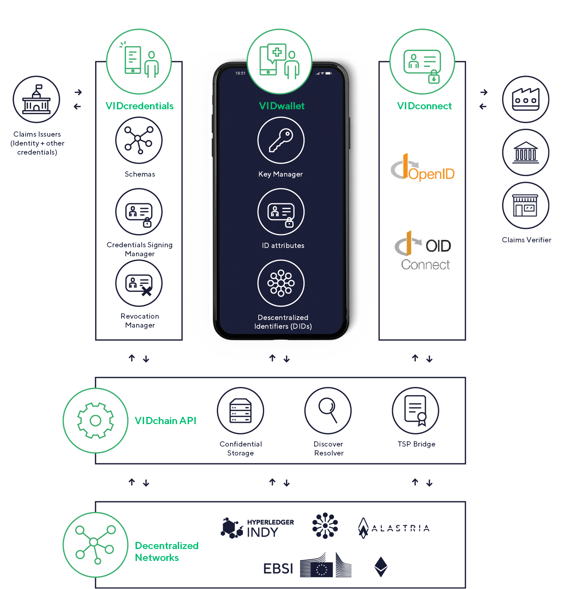

# VIDchain

VIDchain is a product of [Validated ID](https://www.validatedid.com/), a Spanish Qualified Trust Service Provider, providing Self-Sovereign Identity (SSI) and related services. SSI is a rather new concept for managing digital identities with the main goal to return the control over identity data back to the users. If you are interested in further explore SSI and its potential please checkout our [SSI Whitepaper](https://www.validatedid.com/vidchain).

The purpose of this documentation is twofold starting with first, a presentation of a general description and additionally a detailed description about the components. Second, integration guides are presented mainly for software architects and developers that aim to integrate VIDchain components into their systems. 

## Main Features

To underline the advantages of using VIDchain as SSI services provider, we list following the main features of our services. 

- user is in control over their own identity data 
- passwordless SSI authentication flow
- integration with SSI on your **web**, **webapp** or **mobile app**
- managing credentials such as **issue** any kind of **verifiable credentials** to your users
- easily **request** credentials to your users, either to authenticate or authorize them
- adding legal value on top of VC credentials 
- legal binding to users 
- creating credentials from digital certificates (X509 certificates)

## Components Overview 

VIDchain is composed of different building blocks depicted in the architecture figure and listed below:

- **VIDchain API**, the public API of VIDchain used for various actions. 
- **VIDwallet**, an app for users to hold W3C Verifiable Credentials (VC) and generate and manage user DIDs.
- **VIDcredentials**, a library that is used for creating, signing and verifying verifiable credentials, including schema and revocation management. 
- **VIDconnect**, an OpenID Connect provider that is able to perform DID authentication. **DID SIOP library**, a Typescript library that you can use from your app to exchange credentials with the VIDwallet.
- **VIDcredentials**, a service that allows VC management (request and sending credentials).

<!-- 
# This guide

This document provides information on how to use the VIDchain API to:

- Authenticate your users (using standard OpenID Connect!)
  - on your web or webapp
  - on your mobile app
- Issue credentials
- Request credentials
  We'll also show you what do you need to do to register as a client to use VIDchain OpenID provider.

The guide is divided in two parts: the **configuration** part and the **tutorial**. The former provides an overview of the items needed in order to be ready to start the tutorial. Therefore, please read the requirements first so as to get ready for the integration.

- Step 1: [Setting things up & other requirements](/docs/VIDchain/requirements)

  - [Setting up your OIDC client](/docs/VIDchain/requirements#set-up-your-oidc-client)
  - [Create your entity DID](/docs/VIDchain/requirements#create-your-entity-did)
  - [Accessing the API: API Bearer Token Authentication](/docs/VIDchain/requirements#client-id-and-entity-session-key-registration-prod-api-only)
  - [Define the contents of the Verifiable Credentials](/docs/VIDchain/requirements#define-the-contents-of-the-verifiable-credentials)

- Step 2: Web or mobile? Once you have set things up, you can interact with the wallet from your backend or directly from your mobile app:
  - Integrate your [web or webapp with VIDchain](/docs/VIDchain/tutorial)
    - [OIDC flow for DID Auth](/docs/VIDchain/tutorial#oidc-flow-for-did-auth)
    - [Issue Credentials](/docs/VIDchain/tutorial#issue-credentials)
    - [Request and Verify credentials](/docs/VIDchain/tutorial#request-and-verify-credentials)
    - [Present and Verify credentials](/docs/VIDchain/tutorial#present-and-verify-credentials)
  - Integrate your [mobile app using DID SIOP](../4-sioplib.md) 

-->

<!-- move links to proper places -->
## Relevant links:

- [VIDchain demo webapps that show how to integrate with VIDchain APIs](https://github.com/validatedid/VIDchain-demo-v2)
- [VIDchain OpenAPI specs](https://api.vidchain.net/api/v1/api-docs/)
- [VIDwallet APK for Android](https://drive.google.com/file/d/1En7_nhd0ANb3ZZe3DVaMPnmqlRfK8zYC/view?usp=sharing)
- [VIDchain Demo Site](https://try.vidchain.net/demo)

