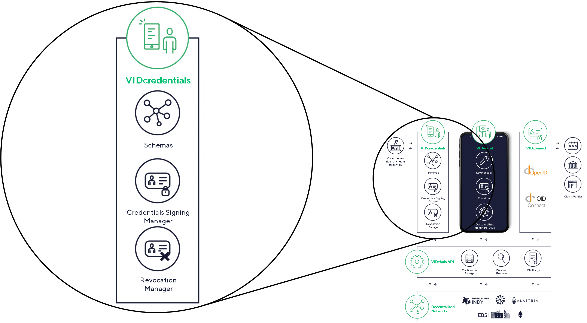

VIDcredentials is a component of VIDchain that is responsible for managing credentials and related services by providing an public API. The VIDcredentials components interacts with external parties such as the credential issuer, but also with VIDchain components such as the VIDchain's backend depicted in the figure below.

## Features

- VIDcredentials provides functionality for credentials to **cover the entire credential lifecycle including issuance and revocation**.
- Another service of VIDcredentials enables the **creation of custom credential templates**.
- Additionally, **VIDcredentials allows the creation of custom credential types**.

## Endpoints

VIDcredentials offers services in a form of an API. These services are mainly credential related services such as creating, presenting or revoking credentials beside other services. Please find a brief description below and a detailed description in the [OpenAPI specification](https://docs.vidchain.net/vidcredentials-openapi).

- **Authentication Service:** This services allows API users to authenticate and retrieve and OAuth bearer token in order to use the API endpoints.
- **Entities Service:** This service endpoint allows the API user to modify attributes related to an entity.
- **Verifiable Credential Services:** Services in this category are used to create either a verifiable ID credential or a verifiable credential and also verify them.
- **Verifiable Presentation Services:** These service endpoints are responsible for creating and verifying verifiable presentations.
- **Credential Request Service:** This service is used to create a credential request.
- **Identifiers Service:** For DID resolution is this service used.
- **Credential Revocation Services:** For revoking credentials as well as to verify the revocation status of a credentials are services in this category used.

<figcaption align="center">
This figure shows the VIDcredentials component also as part of the overall VIDchain architecture. 
</figcaption>
