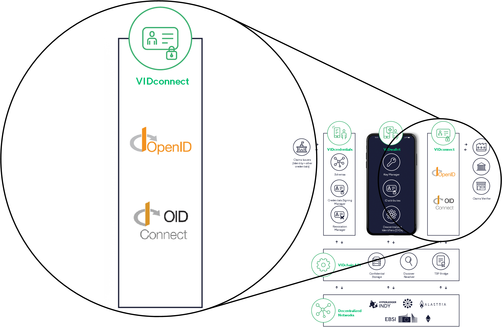

VIDconnect is the component that implements the identity protocols aiming to "connect" VIDchain users to other users and services. In particular, Validated ID has developed its own implementation of the did-auth protocol used to authenticate a user towards a relaying party using DIDs[^1] according to standards. Also, VIDconnect implements the DID SIOP[^2] (Self-Issued OpenID Provider) authentication process.

VIDconnect supports different workflows such as Webapp to App, and the App to App workflow.

## Endpoints

<!--
The current authentication process follows the DID SIOP[^2] (Self-Issued OpenID Provider) authentication flow, which uses JSON Web Tokens (JWT) signed by both parties' DID keys during a mutual authentication flow. It also supports the protocol to exchange Verifiable Credentials[^3] (VCs) as part of the identity token response.

Current version supports only ES256k (and ES256K-R) algorithm (the EC secp256k1).
-->

<figcaption align="center">
This figure shows the VIDconnect component including its place within the overall architecture. 
</figcaption>

[^1]: https://www.w3.org/TR/did-core/
[^2]: https://openid.net/specs/openid-connect-self-issued-v2-1_0.html
[^3]: https://www.w3.org/TR/vc-data-model/
