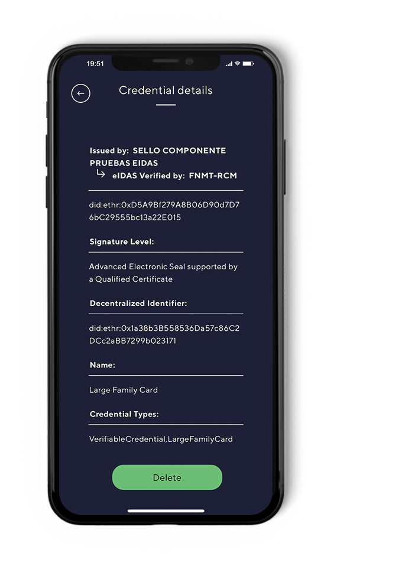
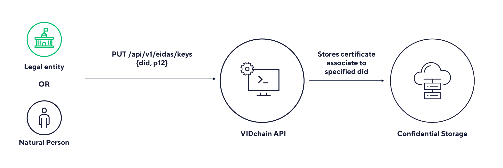
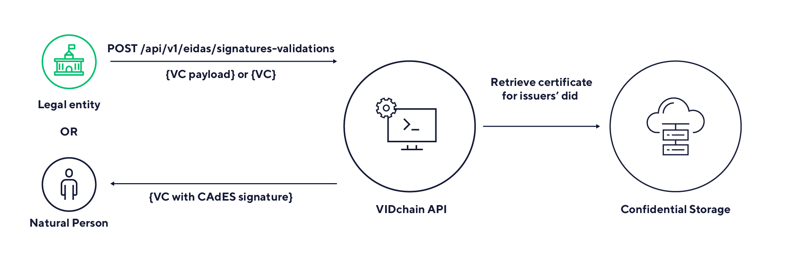
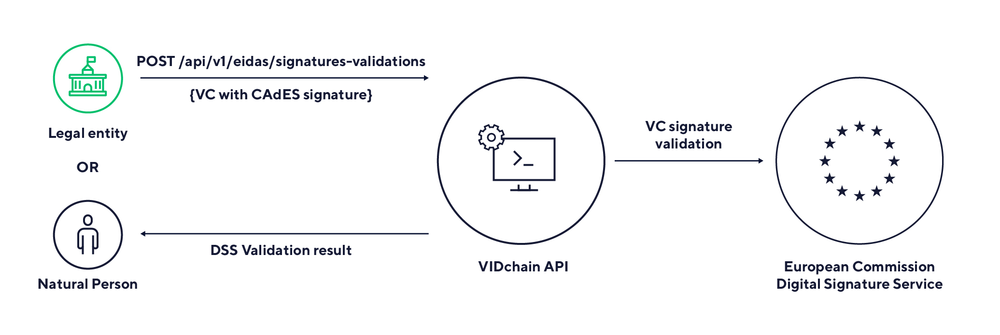

# eIDAS Bridge

The eIDAS bridge consists of an API that allows you to sign and validate credentials using Qualified Electronic Certificates (QEC). As you can see, this is the reason why this tool is called a bridge since it is “bridging” the world of certificates with SSI credentials SSI. For an end user, it should be really simple to use since the API mainly exposes three endpoints for three steps: certificate storage for did association, signature with a QEC (CAdES) and QEC signature validation.

## Current status

Since the project finished at the end of June 2021, VIDchain API has taken the open-source implementation and evolved it to provide an improved eIDAS Bridge with more security for end users. Validated ID offers eIDAS Bridge as a service to help issuers and verifiers to use this innovative solution that fill the gap between certificates and SSI while this last emerges. VIDchain API offers these endpoints shown above as an entity authenticated service and is currently working on providing new features such as support for HSMs and the integration with external Certification Authorities (CAs).

## eIDAS Bridge and Business Process Value

As pioneers and defenders of the SSI paradigm, we are the first ones who wish to create the necessary trust environment so that verifiable credentials can be created with a Level of Assurance&Credibility that allows public and private organizations to start accepting them as elements well supported by the models of trust already covered by the eIDAS(v1) While new eIDASv2 gets formally approved.

This would imply that we can rely on formal processes for the issuance of verifiable credentials, and that the credentials incorporate components recognizable by consumers of Trust Services and the solutions used to recognize eIDAS electronic identities.

For the first case, the credential issuance process could already incorporate the sealing of the credential based on a qualified certificate from the issuer, endorsing with its own credibility the originality of the issued credential, and clearly differentiating it from self-issued credentials. Or, it can be sealed later. And according to the cases, contributing its branding to the issued credential.

In fact, in this sense, a Certification Authority could participate in the Trust chain issuing a credential from their Registration Authority, after a formal verification of the holder, or based on the authentic source that is considered appropriate to the case. It would imply that the signing process was carried out, in a similar way to the qualified signature, in the HSM of the TSP. In this way, we would be able to extend the Trust context of classic electronic identities to the decentralized identities that concern us now. And this would cover not only the geographical context of eIDAS but would be perfectly applicable to any country with advanced electronic signature laws, to explore the use of verifiable credentials backed by their national PKIs.

Regarding the capacity of recognition by the counterparts who want to verify the presentation of a credential, the stamping component itself is verifiable through the eIDAS Bridge, facilitating the recognition of the source entity that has signed the credential, in the same sense given to the act of sealing in PKI. But allowing later to take advantage of the programmatic nature of verifiable credentials for process automation.

## Processes

The eIDAS Bridge supports three main processes focusing on assosiating a DID to a certificate, sealing a VC with this certificate, and finally the verification of a sealed VC. The process flows are illustrated below.

### Step 1: Certificate Storage for DID Association

The issuer sends the certificate and associates it to the DID that will be used as Verifiable Credential (VC) issuer. The API stores the certificate in Confidential Storage.

### Step 2: Signature with a QEC

The issuer requests to sign a VC using his/her previously stored certificate and the API provides a VC containing a CAdES signature.

### Step 3: QEC Signature Validation

The verifier sends a VC with CAdES signature to be validated and the API provides the validation result.
