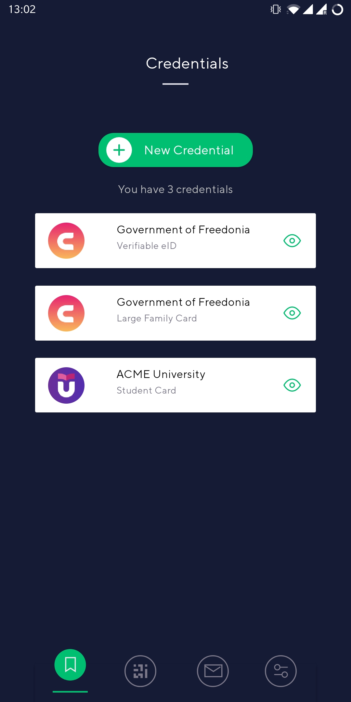

An identity wallet represents one of the core components in an SSI system and so does it in VIDchain. Our identity wallet, the VIDwallet, is a smartphone-based identity wallet aiming to implement the digital counterpart of a physical wallet. This wallet is used by the users to store and protect their assets such as key material, identifier and personal information.  

VIDwallet is designed to act ledger-agnostic meaning that it does not rely on a single DLT or blockchain network. VIDwallet supports already several DLTs and blockchain networks such as EBSI and Ethereum to just name two but it can also be used without distributed network utilizing the DID key[^1] method. Additionally, it does not only supports EBSI identifiers but is also fully EBSI compliant[^2] with their services. 

<!--
As a user, in order to create keys, receive credentials, use them and be able to complete the tutorial you will need a wallet.
-->

VIDwallet is available for Android and Apple smartphones:

- [Android Version](https://play.google.com/store/apps/details?id=com.validatedid.wallet)
- [iOS Version](https://apps.apple.com/us/app/vidwallet/id1554340592)

Once installed, the first time you open the app you’ll be asked to define a PIN code or to authenticate using your biometrics (used to encrypt the keys). As soon as you open the wallet, your keys will be created.

The application has four views:

- **Credentials**: list of all the credentials you own and store in your wallet.
- **Login**: where you can scan a QR code presented by a web page the user asks to authenticate in.
- **Notifications**: list of all the notifications you receive from a credentials provider, like .
- **Settings**

And also a top right (+) button that you can use to self-issue your first Verifiable Credentials.

[^1]: https://w3c-ccg.github.io/did-method-key/ 
[^2]: https://ec.europa.eu/digital-building-blocks/wikis/display/EBSI/Conformant+wallets#find-a-wallet 
