An identity wallet represents one of the core components in an SSI system and so does it in VIDchain. Our identity wallet, the VIDwallet, is a smartphone-based identity wallet aiming to implement the digital counterpart of a physical wallet. This wallet is used by the users to store and protect their assets such as key material, identifier and personal information.

VIDwallet is designed to act ledger-agnostic meaning that it does not rely on a single DLT or blockchain network. VIDwallet supports already several DLTs and blockchain networks such as EBSI and Ethereum to just name two but it can also be used without distributed network utilizing the DID key[^1] method. Additionally, it does not only supports EBSI identifiers but is also fully EBSI compliant[^2] with their services.

## Features

- Users that use VIDwallet are in **full control over their own data** including identifiers, key material and credentials.
- VIDwallet is utilized to **store and mange personal information** in form of credentials.
- The VIDwallet also **manages key material** of users and stores them in a tamper-proof storage namely the secure element of the mobile phone.
- VIDwallet **provides an eKYC service** in which the users can use their legal identity card or passport in a KYC process resulting in an identity credential that has a strong data-to-user-binding.
- The **personal data are securely stored in encrypted form** so that only the user can access them by following DIF's confidential storage specification[^3].
- VIDwallet **supports a variety of DID methods** even without depency to a DLT or blockchain network.
- VIDwallet offers a service, VIDcerts, that **enables the transformation of X509 certificates into VCs** and stores the in the wallet.
- VIDwallet fulfilled the EBSI compliance tests and is **officially EBSI compliant** and listed as EBSI compliant wallet solution.
- The wallet application is **available for both Apple and Android devices**.

## VIDwallet Screens

VIDwallet provides five screens to the user, detailed as follows:

|   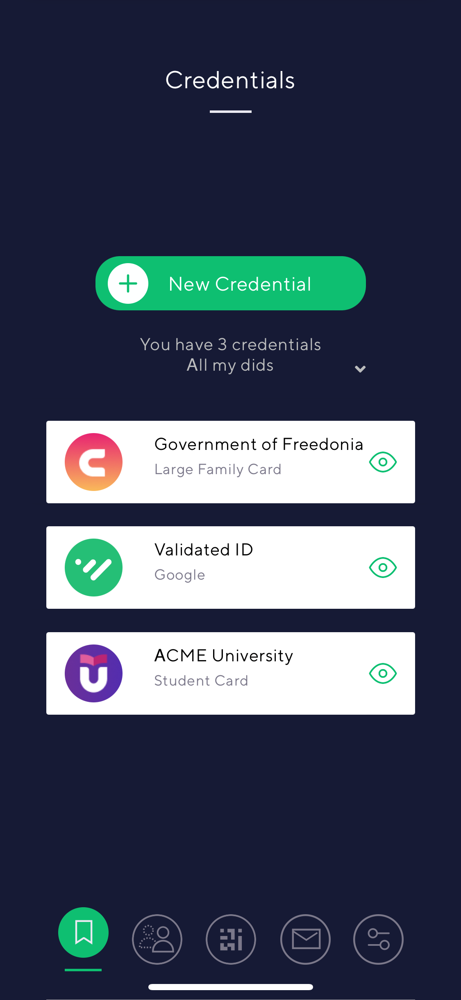
<b>The start screen is the credentials screen, which lists all stored credentials related to the holder. Also, new credentials can be added in this screen.</b>
   |                         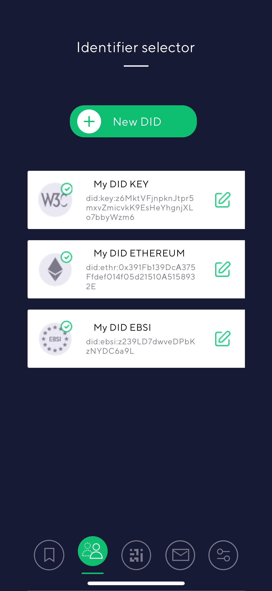
<b>In the identity screen, the users can list and select their available identifiers. This way, the support for multiple DIDs is achieved.</b>
                          |
| :------------------------------------------------------------------------------------------------------------------------------------------------------------------------------------------------------------------: | :-------------------------------------------------------------------------------------------------------------------------------------------------------------------------------------------------------------------------------------------: |
| 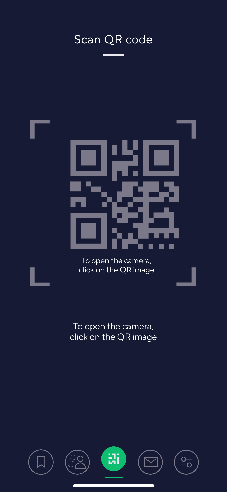
<b>The scan QR-code screen is used to scan QR-codes that are used to establish a connection and for requesting credentials for data exchange or authentication. </b>
 | 
<b>The messages and notification center screen displays notifications and messages to the user. For instance, when a credential is requested or a new one is offered will be.</b>
 |
|            
<b>The Setting screen displays the available settings to the user like for example the used environment or the display language. </b>
             |                                                                                                                                                                                                                                               |

## Create Credential Workflows

Following, we present the main flows related to create a new credential including screenshots and a detailed description.

### Start Create Credential Flow

In this flow, the user starts on the start screen and selects "New Credential". Next, a screen is displayed which displays the identifier selection to the user. In the displayed case, three identifier are available because three were registered for the user. The number of identifier could also be higher or lower. After selecting one identifier the third screen is displayed with all possible ways to create a credential. The selected identifier will be used in the credential creation process as subject id.

|  | 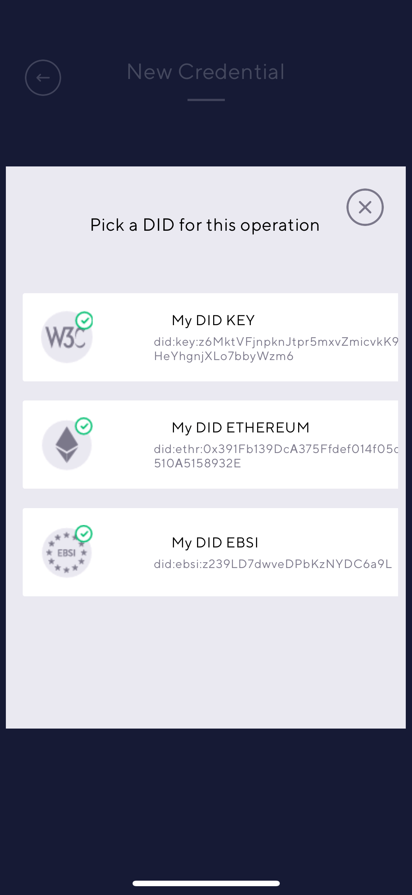 | 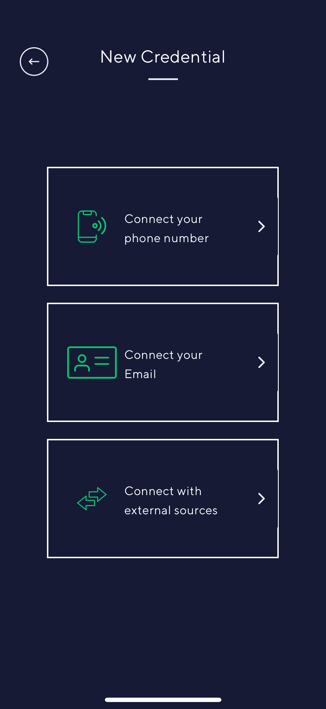 |
| :-----------------------------------------: | :--------------------------------------------: | :-----------------------------------------------------: |

### Create Phone Number or Email Credential

This flow focuses on creating a phone number or email credential. When the user selects "connect to your phone number", the second screen will be displayed. Next, the user enters the phone number and will receive a TAN code which needs to be entered afterwards. In case of the email credential, the third screen is displayed. After entering the email address by the user, a code is sent to the email address which has to be entered afterwards. In both cases, after entering the correct verification code a credential is added to the list of credentials.

|  | 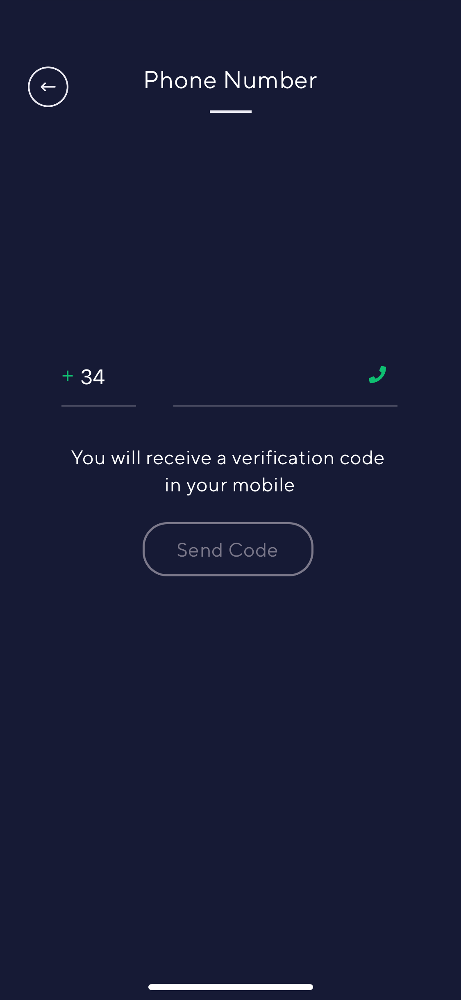 | 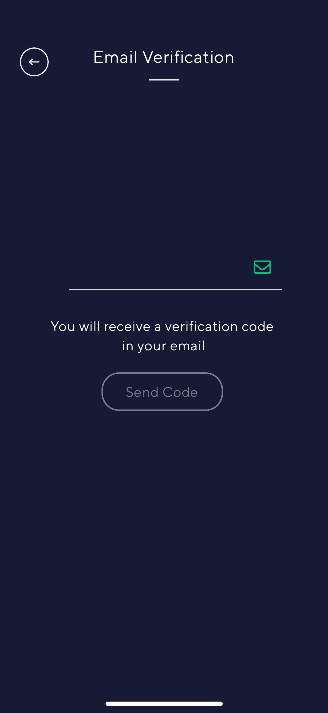 |
| :-----------------------------------------------------: | :-----------------------------------------------------: | :-----------------------------------------: |

### Create ID Document-Based Credential

In this process flow, the user can create an ID credential that is based on a legal document in a so-called Know-Your-Customer (KYC) process. The advantage of such ID credential is that it has legal value and the correctness of the attributes is ensured. First, the user selects connect with external resources and arrives at the first screen here called "External Resources". On this screen, the user selects "Verify your ID" and the next screen is shown. There, the user can select if either the passport or an ID card is used for the identity proofing in the KYC process. In the example, the user selected passport, which starts the KYC process with the first step of scanning the passport. After this, other instructions will follow. After successfully performing the KYC process, the user receives an identity credential that is stored in the wallet and can afterwards be used for identification and authentication processes.

| 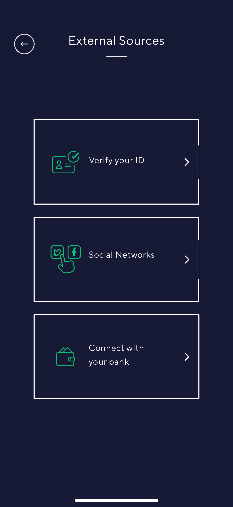 | 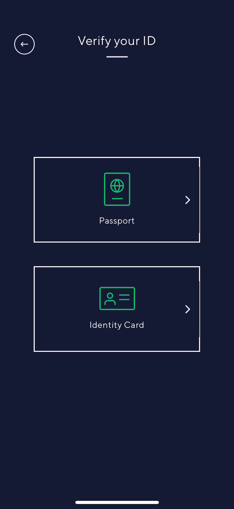 | 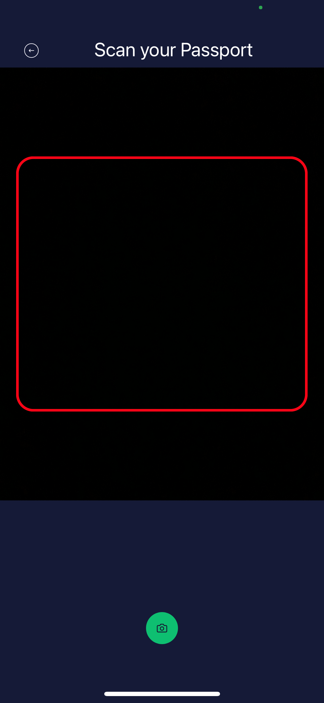 |
| :------------------------------------------------------: | :--------------------------------------------------: | :-------------------------------------------------: |

### Create Social Network-Based Credential

Another option on the external sources screen is to create a credential using social networks, which the user selects. The next screen shows two social networks that can be used to create a social network based credential. In this example, the user has selected facebook and is forwarded to the facebook log in page where the user can also select which data are going to be shared and later be in the credential.

|  | 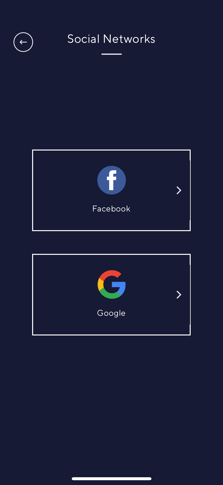 | 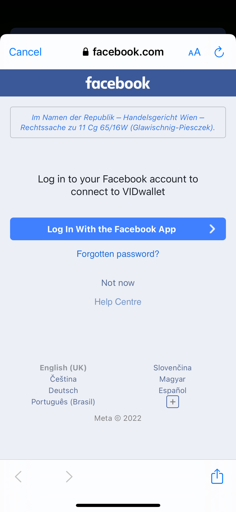 |
| :------------------------------------------------------: | :--------------------------------------------------------: | :----------------------------------------------: |

### Create Credential From A Bank Account

Last but not least, the option to create a credential from your bank account. In this case, the user selects "Connect to your bank". Next, a screen is shown which informs the user that VIDwallet uses a service called Plaid to retrieve data from the banks as well as what data are going to be accessed. After pressing continue, a screen is shown where the user selects the bank where the bank account is located. Next, the user has to log in at the banks and confirms the data transfer. At the end of the process, a credential is issued to the user's wallet based on the data provided by the bank.

|  | 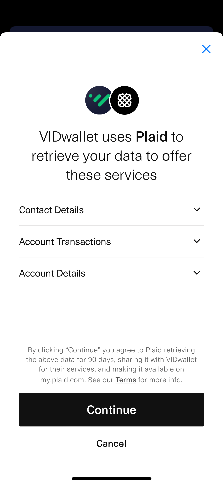 | 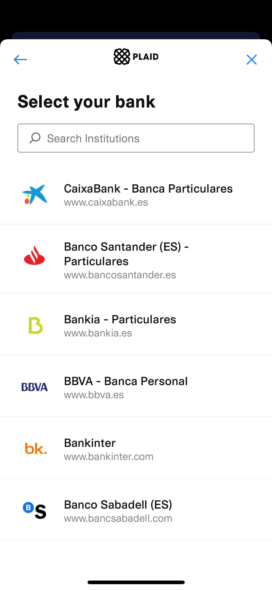 |
| :------------------------------------------------------: | :-----------------------------------------------------: | :-----------------------------------------------: |

## Get VIDwallet

VIDwallet is available for Android and Apple smartphones:

- [Android Version](https://play.google.com/store/apps/details?id=com.validatedid.wallet)
- [iOS Version](https://apps.apple.com/us/app/vidwallet/id1554340592)

## Test VIDwallet

Validated ID offers a tutorial for the users to get familiar with VIDwallet. The user journey of this tutorial focuses on a student that has a large family and wants to first, get a big family credential using the identity credential at the government page. And second, use this big family credential to get a discount on the studying fees. The tutorial describes all steps starting with the installation of the mobile app up to requesting the discount at the university.

**[Start Tutorial](https://try.vidchain.net/demo/tutorial)**

[^1]: https://w3c-ccg.github.io/did-method-key/
[^2]: https://ec.europa.eu/digital-building-blocks/wikis/display/EBSI/Conformant+wallets#find-a-wallet
[^3]: https://identity.foundation/edv-spec/
