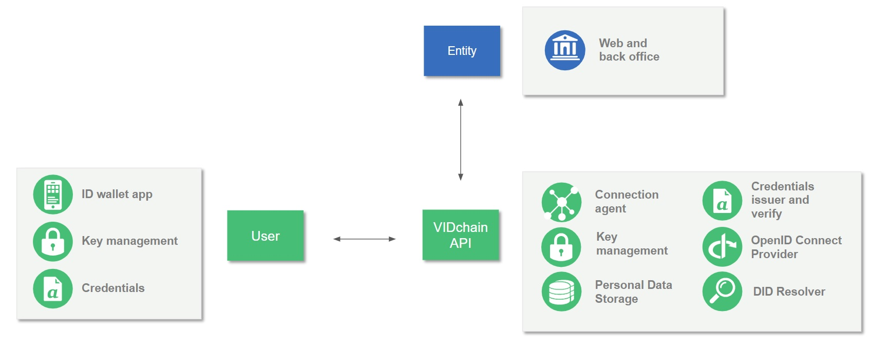

# VIDchain

VIDchain is an SSI service that is composed of different building blocks:

- **VIDwallet**, an app for users to hold W3C Verifiable Credentials (VC) and generate and manage user DID.
- **VIDconnect**, an OpenID Connect provider that is able to perform DID authentication.
- **VIDcredentials**, a service that allows VC management (request and sending credentials).
- **DID SIOP library**, a Typescript library that you can use from your app to exchange credentials with the VIDwallet.

# What can I do with VIDchain?

Easy!

You can:

- easily integrate **passwordless authentication using SSI** on your **web**, **webapp** or **mobile app**.
- easily **issue** any kind of **verifiable credentials** to your users.
- easily **request** credentials to your users, either to authenticate or authorize them.

We'll show you how.

# This guide

This document provides information on how to use the VIDchain API to:

- Authenticate your users (using standard OpenID Connect!)
  - on your web or webapp
  - on your mobile app
- Issue credentials
- Request credentials
  We'll also show you what do you need to do to register as a client to use VIDchain OpenID provider.

The guide is divided in two parts: the **configuration** part and the **tutorial**. The former provides an overview of the items needed in order to be ready to start the tutorial. Therefore, please read the requirements first so as to get ready for the integration.

- Step 1: [Setting things up & other requirements](/docs/VIDchain/requirements)

  - [Setting up your OIDC client](/docs/VIDchain/requirements#set-up-your-oidc-client)
  - [Create your entity DID](/docs/VIDchain/requirements#create-your-entity-did)
  - [Accessing the API: API Bearer Token Authentication](/docs/VIDchain/requirements#client-id-and-entity-session-key-registration-prod-api-only)
  - [Define the contents of the Verifiable Credentials](/docs/VIDchain/requirements#define-the-contents-of-the-verifiable-credentials)

- Step 2: Web or mobile? Once you have set things up, you can interact with the wallet from your backend or directly from your mobile app:
  - Integrate your [web or webapp with VIDchain](/docs/VIDchain/tutorial)
    - [OIDC flow for DID Auth](/docs/VIDchain/tutorial#oidc-flow-for-did-auth)
    - [Issue Credentials](/docs/VIDchain/tutorial#issue-credentials)
    - [Request and Verify credentials](/docs/VIDchain/tutorial#request-and-verify-credentials)
    - [Present and Verify credentials](/docs/VIDchain/tutorial#present-and-verify-credentials)
  - Integrate your [mobile app using DID SIOP](../4-sioplib.md)

# Get the VIDwallet app

As a user, in order to create keys, receive credentials, use them and be able to complete the tutorial you will need a wallet.

You can download the VIDchain reference wallet here:

- [Android Version from Google Play](https://play.google.com/store/apps/details?id=com.validatedid.wallet)

Once installed, the first time you open the app you’ll be asked to define a PIN code or to authenticate using your biometrics (used to encrypt the keys). As soon as you open the wallet, your keys will be created.

The application has four views:

- **Credentials**: list of all the credentials you own and store in your wallet.
- **Login**: where you can scan a QR code presented by a web page the user asks to authenticate in.
- **Notifications**: list of all the notifications you receive from a credentials provider, like .
- **Settings**

And also a top right (+) button that you can use to self-issue your first Verifiable Credentials.

# Relevant links:

- [VIDchain demo webapps that show how to integrate with VIDchain APIs](https://github.com/validatedid/VIDchain-demo-v2)
- [VIDchain OpenAPI specs](https://api.vidchain.net/api/v1/api-docs/)
- [VIDwallet APK for Android](https://drive.google.com/file/d/1En7_nhd0ANb3ZZe3DVaMPnmqlRfK8zYC/view?usp=sharing)
- [VIDchain Demo Site](https://try.vidchain.net/demo)
